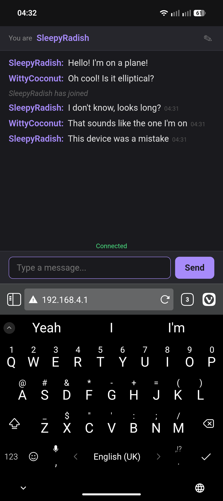

# PlaneTalk



ESP32 firmware that creates an open WiFi access point with a captive portal chat room. Connect to the AP, get a chat window, talk to everyone else connected.

Built for situations where you want local, infrastructure-free group chat — planes, buses, conferences, camping, or anywhere without internet.

## Features

- **Captive portal**: connecting to the "PlaneTalk" WiFi automatically opens the chat (Android, iOS, Windows, macOS, Firefox)
- **Real-time chat**: WebSocket-based, messages appear instantly
- **Auto nicknames**: users get a deterministic AdjectiveFruit name (e.g. "ExcitableBanana") based on their IP
- **Nickname changes**: tap the edit button to pick your own name
- **Private messages**: tap any username to send them a private message
- **Message history**: new joiners see the last 50 messages
- **Mobile-friendly**: dark theme, full viewport, large touch targets

## Hardware

Any ESP32 development board. Tested with ESP32-C3.

## Building

Requires [PlatformIO](https://platformio.org/).

```
pio run
```

## Flashing

```
pio run -t upload
```

## Usage

1. Flash the firmware to your ESP32
2. Look for the "PlaneTalk" WiFi network on your phone/laptop
3. Connect — the chat opens automatically via captive portal
4. Start talking

Up to 10 devices can connect simultaneously.
